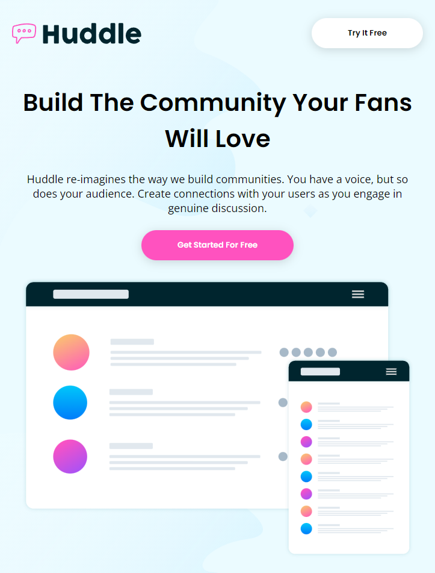

# Frontend Mentor - Huddle landing page with alternating feature blocks solution

This is a solution to the [Huddle landing page with alternating feature blocks challenge on Frontend Mentor](httpswwwfrontendmentoriochallengeshuddle-landing-page-with-alternating-feature-blocks-5ca5f5981e82137ec91a510) 
Frontend Mentor challenges help you improve your coding skills by building realistic projects. 

## Overview

### The challenge

Users should be able to:

- View the optimal layout for the site depending on their device's screen size

### Screenshot

### Links

- Live Site URL: [Add live site URL here](https://your-live-site-url.com)

### Built with

- Semantic HTML5 markup
- CSS custom properties
- [Font Awesome](https://fontawesome.com/) - For icons

### Useful resources

- [W3 School](https://www.w3schools.com/) - This helped me for XYZ reason. I really liked this pattern and will use it going forward.

## Author

- Frontend Mentor - [@CarlosAVDS](https://www.frontendmentor.io/profile/CarlosAVDS)
